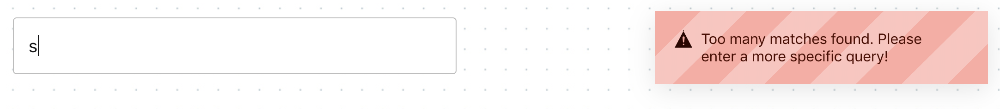

# Admission criteria

- The 'goit-js-hw-12-countries` repository has been created.
- When submitting homework, there are two links: to the source files and a working
page on GitHub pages.
- When visiting the work page (GitHub pages) of the task, there are no errors and
warnings in the console.
- The names of variables and functions are clear, descriptive.
- The project is built using `Webpack'.
- The code is formatted with `Prettier'.
- Add minimal styling.
- There is a file `fetchCountries.js ` with default function export
`fetchCountries(SearchQuery)`, which returns a promise with an array of countries, the result
of an API request.

## Search for countries

Create a small application to search for data about a country by its partial or full
name. Use the [Rest Countries API](https://restcountries.eu /), namely
endpoint [/name](https://restcountries.eu/#api-endpoints-name ), which returns
an array of objects of countries that fall under the search criteria.

It is enough for the application to work for most countries. Some countries,
such as `Sudan`, may cause problems because the country name is
part of the name of another country, `South Sudan'. No need to worry about these
exceptions.

The interface is very simple. The user enters the name of the country to search in
the text field.

⚠️ **ATTENTION!** HTTP requests to the backend do not occur according to the form's submission, forms
no, but when typing the country name in the input, that is, by the `input` event. But to do
An HTTP request cannot be made with each keystroke, since
many HTTP requests will be made at the same time, which will be executed in an unpredictable order (race
conditions). Therefore, an approach must be applied to the event handler
`debounce` and make an HTTP request after `500ms' after the user
has stopped typing. Use the npm package
[lodash.debounce](https://www.npmjs.com/package/lodash.debounce).

If the backend returned more than 10 countries that fit the criteria entered
by the user, a notification is displayed in the interface that it is necessary
to make the request more specific. For notifications, use the plugin
[pnotify](https://github.com/sciactive/pnotify).

If the backend returned from 2 to 10 countries, a list of the namesa
of the found countries is displayed under the input.

If the backend returned an array with one country, the markup with
country data is rendered in the interface: name, capital, population, languages and flag.

